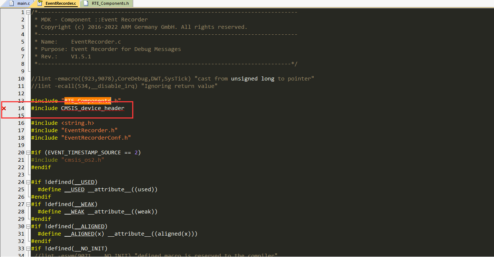
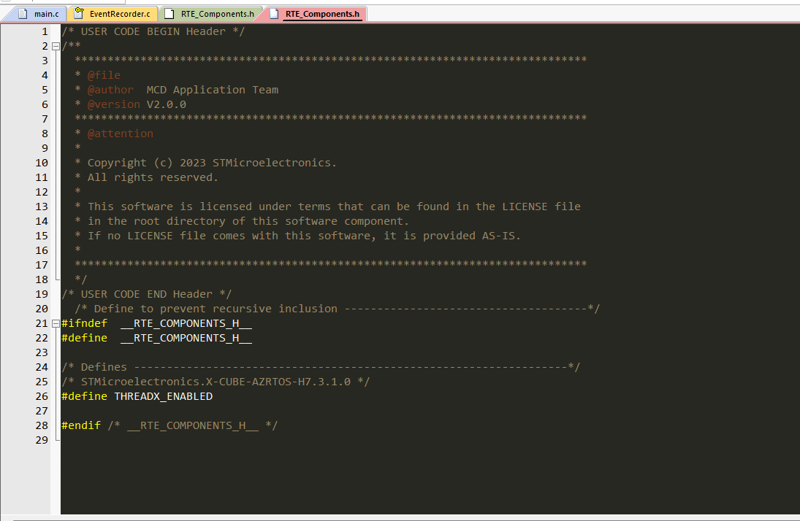
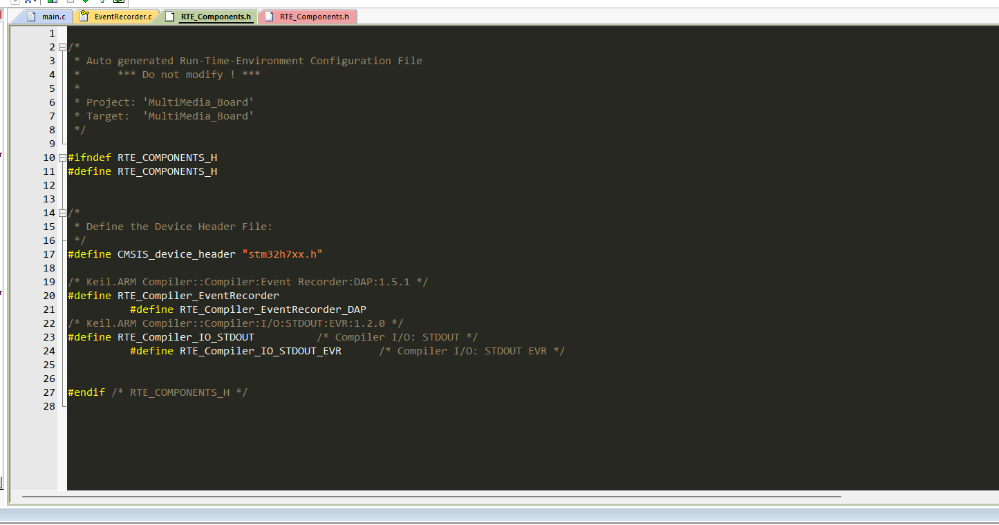
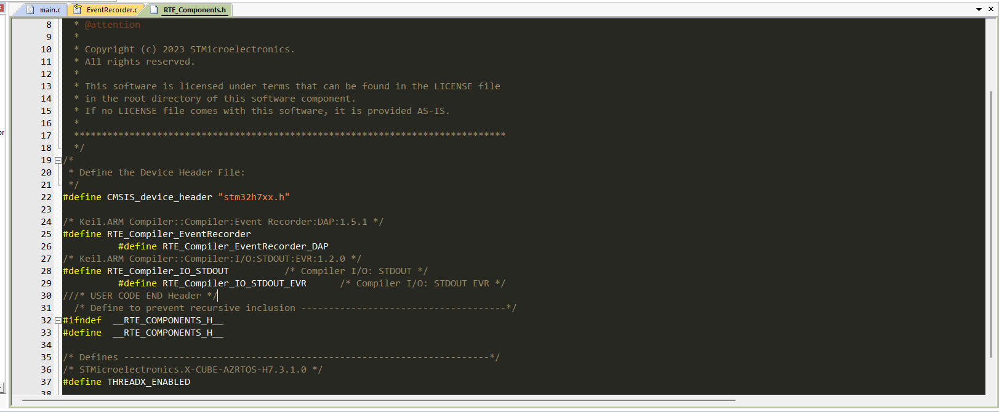

# MultiMediaBoard

开发环境：基于 STM32H750_ArtPi +对应的多媒体板。

移植内容：

- [x] ThreadX
- [x] letter-shell + ThreadX 线程管理


- [x] MultiButton
- [x] SEGGER_HardFault
- [x] EventRecorder
- [x] 基于 CMSIS RTX5 的原子操作函数
- [x] perf_counter
- [ ] ILI9488 + ToughGFX：这屏幕有点玄学了，先转去玩我的 CherryUSB
- [ ] CherryUSB

# 开发问题记录

## 1 EventRecorder无法正确指向对应的RTE_Components.h

在原先的 App 程序下进行 ThreadX 的配置，配置完成后，发现 `EventRecorder.h` 报出以下错误：




主要原因在于 `RTE_Components.h`。STM32CubeMX 在生成 ThreadX 项目的过程中，生成了另一个 `RTE_Components.h` 文件：



而此文件中，并没有 CMSIS 相关的配置，相关配置存放在 Keil 生成的 `RTE_Components.h`文件中：



文件的错误引用导致了此 Bug，为了不影响文件自动生成的结构，我们选择在 STM32CubeMX 生成的 `RTE_Components.h`文件中添加以下代码：

```c
/*
 * Define the Device Header File: 
 */
#define CMSIS_device_header "stm32h7xx.h"

/* Keil.ARM Compiler::Compiler:Event Recorder:DAP:1.5.1 */
#define RTE_Compiler_EventRecorder
          #define RTE_Compiler_EventRecorder_DAP
/* Keil.ARM Compiler::Compiler:I/O:STDOUT:EVR:1.2.0 */
#define RTE_Compiler_IO_STDOUT          /* Compiler I/O: STDOUT */
          #define RTE_Compiler_IO_STDOUT_EVR      /* Compiler I/O: STDOUT EVR */
```

如图：



问题解决。
